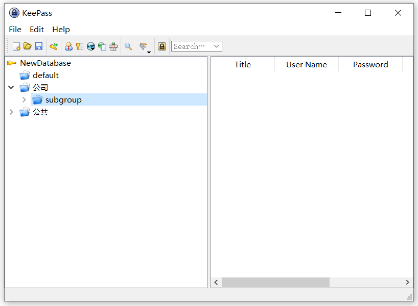
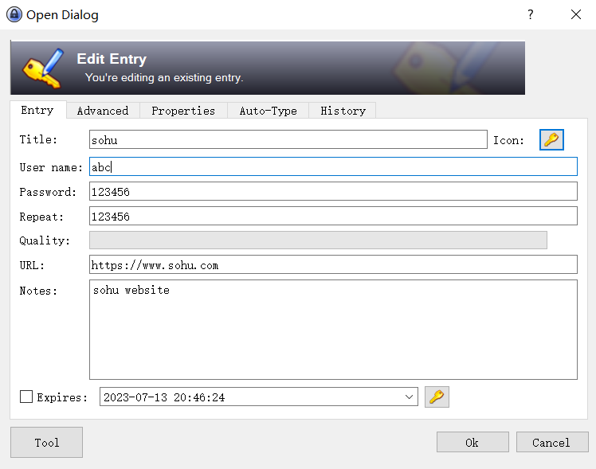

中文 | [English](README.md)
# 关于 KeePassGo
一个用 therecipe/qt (https://github.com/therecipe/qt) 实现的 KeePass (https://keepass.info/)  
## Why KeePass?
今天，你必须记住许多密码。许多网站、电子邮件帐户、网络服务器、网络登录等都需要密码。此外，你应该为每个帐户使用不同的密码，因为如果你在任何地方都只使用一个密码，而有人得到了这个密码，你就会遇到问题：小偷会访问你的所有帐户。

KeePass是一个免费的开源密码管理器，可以帮助您以安全的方式管理密码。您可以将所有密码存储在一个数据库中，该数据库使用主密钥锁定。所以你只需要记住一个主密钥就可以解锁整个数据库。数据库文件使用目前已知的最佳和最安全的加密算法（AES-256、ChaCha20和Twofish）进行加密。有关更多信息，请参阅功能页面。

它真的免费吗？是的，KeePass确实是免费的，而且更重要的是：它是开源的（OSI认证）。您可以查看它的完整源代码，并检查安全功能是否正确实现。

## 关于 therecipe/qt
Qt是一个免费的开源小工具工具包，用于创建图形用户界面以及在各种软件和硬件平台上运行的跨平台应用程序，底层代码库几乎没有变化。

Go，也被称为Golang，是谷歌设计的一种编程语言。

thercipe/qt允许您完全用Go、JavaScript/TypeScript、Dart/Flutter、Haxe和Swift编写qt应用程序

除了提供的语言绑定外，thercipe/qt还大大简化了qt应用程序在各种软件和硬件平台上的部署。

在撰写本文时，几乎所有的Qt函数和类都是可访问的，您应该能够找到构建功能齐全的Qt应用程序所需的一切。

# ScreenShots

