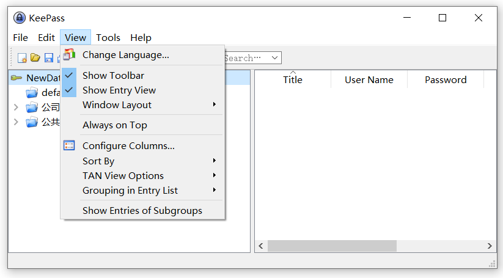

[中文](README-zh-CN.md) | English

# About KeePassGo
an implementation of go for KeePass (https://keepass.info/) using therecipe/qt (https://github.com/therecipe/qt).
## Why KeePass?
Today, you have to remember many passwords. You need a password for a lot of websites, your e-mail account, your webserver, network logins, etc. The list is endless. Also, you should use a different password for each account, because if you would use only one password everywhere and someone gets this password, you would have a problem: the thief would have access to all of your accounts.

KeePass is a free open source password manager, which helps you to manage your passwords in a secure way. You can store all your passwords in one database, which is locked with a master key. So you only have to remember one single master key to unlock the whole database. Database files are encrypted using the best and most secure encryption algorithms currently known (AES-256, ChaCha20 and Twofish). For more information, see the features page.

Is it really free?
Yes, KeePass is really free, and more than that: it is open source (OSI certified). You can have a look at its full source code and check whether the security features are implemented correctly.

## About therecipe/qt
Qt is a free and open-source widget toolkit for creating graphical user interfaces as well as cross-platform applications that run on various software and hardware platforms with little or no change in the underlying codebase.

Go, also known as Golang, is a programming language designed at Google.

therecipe/qt allows you to write Qt applications entirely in Go, JavaScript/TypeScript, Dart/Flutter, Haxe and Swift

Beside the language bindings provided, therecipe/qt also greatly simplifies the deployment of Qt applications to various software and hardware platforms.

At the time of writing, almost all Qt functions and classes are accessible, and you should be able to find everything you need to build fully featured Qt applications.

# ScreenShots

